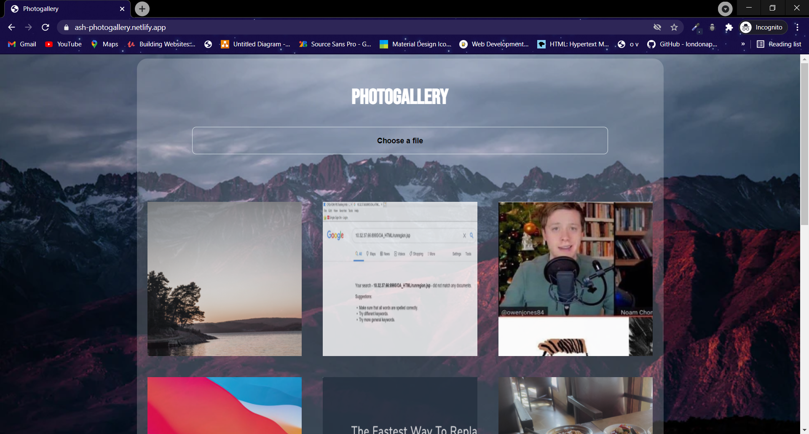
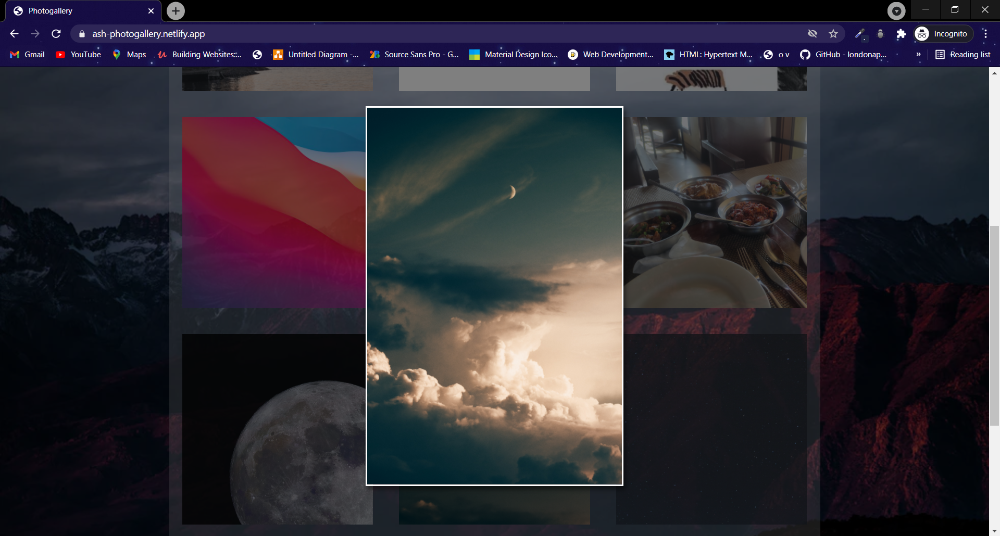

# Photo Gallery
> A photogallery application created using React , Firebase  
> [Live Demo](https://ash-photogallery.netlify.app/)

## Table of contents
* [General info](#general-info)
* [Screenshots](#screenshots)
* [Technologies](#technologies)
* [Setup](#setup)
* [Features](#features)
* [Status](#status)

## General info
The project is a simple photogallery app which stores the image uploaded by user in the firebase real time database known as firestore. When user clicks on a photo a modal window open up which shows the image in the resolutions uploaded by user. Firebase is used to store the images. Pure CSS and material-ui/core is used for styling.   

## Screenshots

Gallery

Modal

## Technologies
* React - version 17.0.2
* material-ui/core - version 4.11.3 
* Firebase - version 8.5.0 

## Setup

In the project directory, first install all the dependenices run:
## `npm install`

To start the project in the project directory run:
## `npm start`

## Features
List of features ready and TODOs for future development 
* Responsive
* Modal window

## Status
Project is : _in progess_ 
